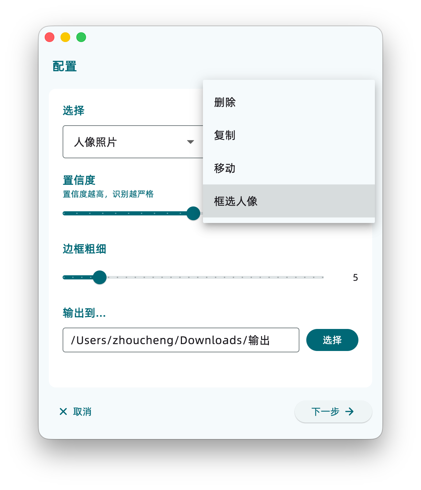
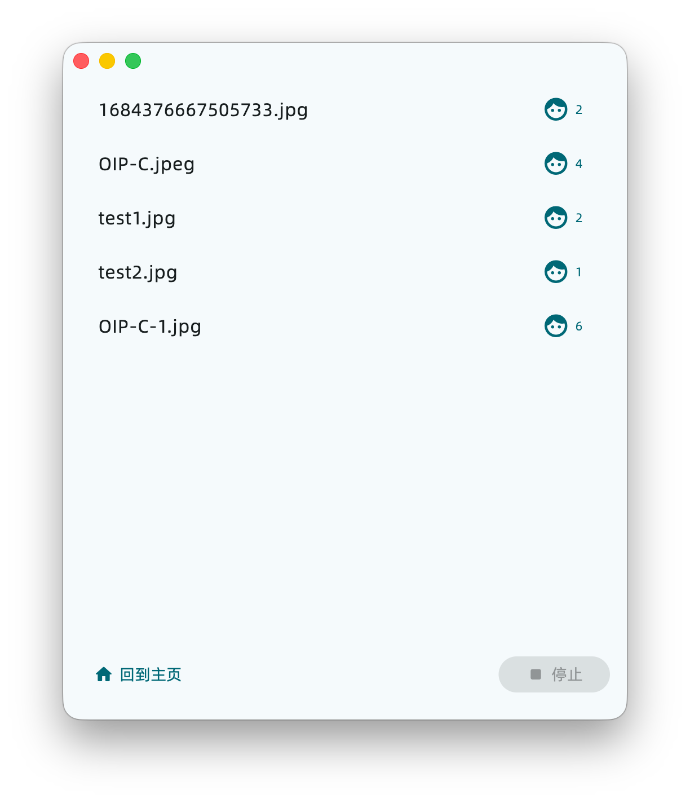

# FaceDetector

Also available in English. Click [HERE](/documents/en.md) to view the English version of the README

## 简介

这是一个人脸检测的工具，支持
- 复制/移动/删除 人像照片/非人像照片 到某个目录
- 框选照片中的人像
- 修改置信度（判定严格程度）

核心模块[在这里](https://github.com/Zhoucheng133/Face-Detector)使用Python开发

## 截图

