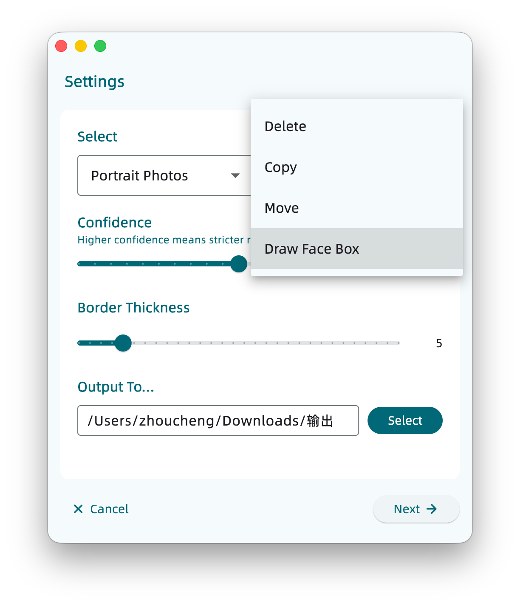
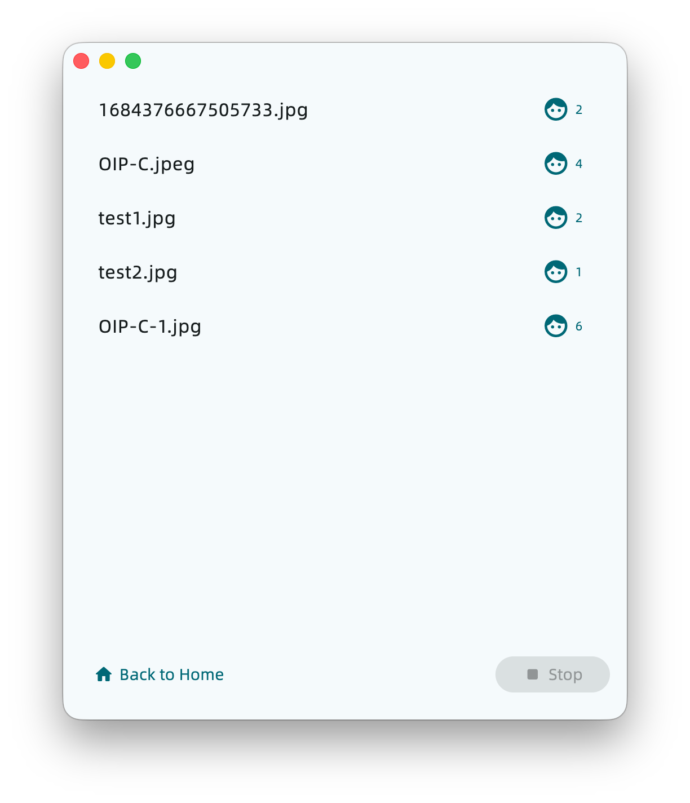

# FaceDetector

中文版请点击 [这里](../README.md) 查看。

## Introduction

A face detection and organization tool that supports:
- Copying, moving, or deleting portrait and non-portrait photos to a designated directory.
- Drawing bounding boxes around detected faces in photos.
- Adjusting the confidence threshold (detection strictness).

The core module is developed in Python and available [HERE](https://github.com/Zhoucheng133/Face-Detector).

## Screenshots

